# project-geoloc [Video Demo][11]

## Members
 * Feng DING, database structure design, user service, question service, chart service, uploadImage service (backend) all the admin functionnalities (frontend)
 * Thibaut SORIANO, mocha test of all the services (backend)
 * Zhengqin YAN, Angular, login and signup, google map, questions and its blog (frontend)
 * Kaiwen YU, display user position, display blog content (frontend)
 
## Contacts
- Feng DING <feng.ding@etu.unice.fr>
- Thibaut SORIANO <thibaut.soriano@etu.unice.fr>
- Zhengqin YAN <zhengqin.yan@etu.unice.fr>
- Kaiwen YU <kaiwen.yu@etu.unice.fr>

## Introduction
Our project which name is geoloc is a game like orienteering. During your play, you need to answer the questions step by step to achieve the final goal. It shows you a place on the google map and you need to go to that place to find out the answer of the question which asked by the system. If your answer is correct you could get a new question, if not you need to try to find out another response.    

This documents gives you the instructions of how to install and to use this application.

## Installation

### Prerequisites

##### MongoDB
This project asked you to use the [MongoDB][1] at the server side to store all the data. So please make sure that you have installed the MongoDB correctly on your computer. You could follow this [tutorial][2] to download and to install the latest version (3.4) of MongoDB Community Edition on your computer. You could use [Linux][3], [Mac OS][4] or [Windows][5].

After the installation is finished, please make sure that you could see the following sentence
`It looks like you are trying to access MongoDB over HTTP on the native driver port.` at the [localhost:27017][10] after the MongoDB service has been started.

#### Node
The [NodeJS][7] is also required to compile the [ECMAScript 6][6]. The version that we suggest is `v6.9.2`.

#### Bower
The [Bower][8] is also useful to install the module, such as angular, bootstrap, of the frontend. The latest version is `1.8.0`. 

#### Socket.io
Allow users to chat on real time.

#### Ubuntu or Windows
After all the preparation above were ready, you could begin to install our application on your ubuntu or windows system.

##### Ubuntu
If your system is `Ubuntu` it could be easy. You just need to execute the file of `install_local.sh` to begin the installation. Maybe you need to run it in the `sudo` mode.

##### Windows
You need to follow the following steps to finish the installation.
Open the `cmd` and go to the folder of the geoloc.
 * 1. Install user service.
    `cd backend/user` then `npm install`
 * 2. Install questionn service.
    `cd backend/question` then `npm install`
 * 3. Install upload image service.
    `cd backend/uploadImage` then `npm install`
 * 4. Install chart service 
    `cd backend/chart` then `npm install`
 * 5. Install the frontend
    `cd frontend/` then `npm install` then `bower install`
 * 6. Initial all questions and an admin user
    `in the root folder` then `mongo localhost/geoloc initial.js`
    

### Running
##### Ubuntu
To start all the services, you need to execute the file of `run_local.sh`.
The user service is listening at port `8080`.
The question service is listening at port `8081`.
The uploadImage service is listening at port `8082`.
And you could open the frontend at port `3000`.
So please make sure that all the ports are free.

You could open the [localhost:3000][9] from the broswer to start to use our application on local.

To stop the application you could use `stop_local.sh`.

##### Windows
It could be a little bit complex to run our application on windows because you need to run all the services manually.
 * 1. Run user service.
    `cd backend/user` then `node user_app.js`
 * 2. Run questionn service.
    `cd backend/question` then `node question_app.js`
 * 3. Run upload image service.
    `cd backend/uploadImage` then `node uploadImage.js`
 * 4. Run chart service.
    `cd backend/chart` then `node chartServer.js`
 * 5. Run the frontend
    `cd frontend/` then `node server.js`
After all the services were run correctly, you could open the [localhost:3000][9] from the broswer to start to use our application on local.

To stop the application please close each service manually.

##### Remark
If you want to use it in your server or you want to use a computer use a server do not forget to change the address IP (`var URLServer = 'http://localhost';`) in the file `frontend/app/homeRouter.js` to the address IP of your computer or your server.

### Testing
##### Ubuntu
You can run the command `mocha -u tdd` in each backend subdirectory (`backend/user`, `backend/question`, `backend/uploadImage`) in order to run each service related test suites. Before running it, you must launch services by using ./run_local.sh in root directory.
We did two test files for each service (a service corresponds to a subdirectory) :
- unit testing calling js file functions, in order to make sure this functions work fine by their own. This tests allow us to know if a problem is coming from the function.
- integration testing, calling function by sending HTTP request to urls. This tests allow us to know if a problem is coming from the communication (can't reach url for instance).

We did tests only for our two main services (users and questions), it was mostly needed for this ones, because they are the biggest and we wrote it from scratch, so we can show we know how it works. The two others are small, and upload image uses an API, so we did not test it.

With Mocha testing, each test file has the same structure :
- before starting test suite, we create all variables we need for the tests
- then we open test suite for a service ("question" for example)
- we have two default functions, suiteStartup and suiteTeardown, which are respectively executed at beginning / end of the test suite, we use it to initialize and clean variables
- to test a function, we open a suite("#functionName()")
- in this suite, we can use as many test() functions as we need

If all test pass (integration + unit), it means that no problems comes from the communication (all url are correct) and no problem comes from the functions itselves, so we can trust our system.

## How to Use
### Homepage
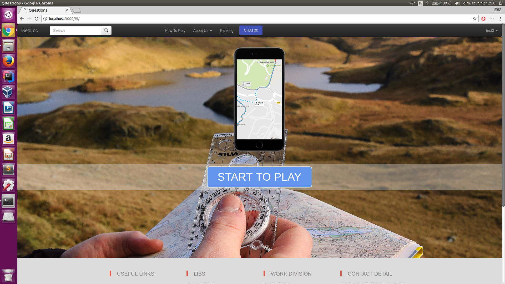
### Login and register
Before start, you need to create your own account. You just need to give a nickname and a password.
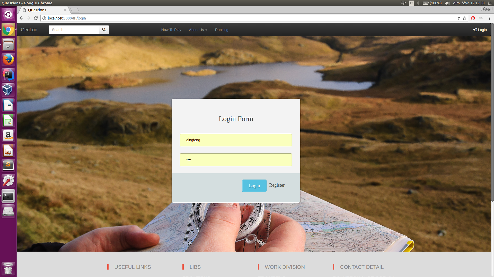

### How to Play
In this page, we present a video which show you how to use our system.
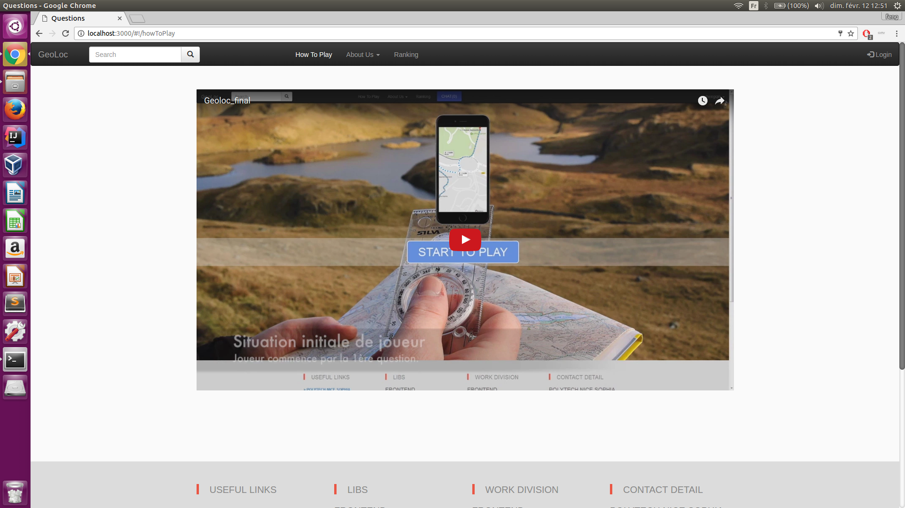
### Ranking
You could also see a ranking of all the players.
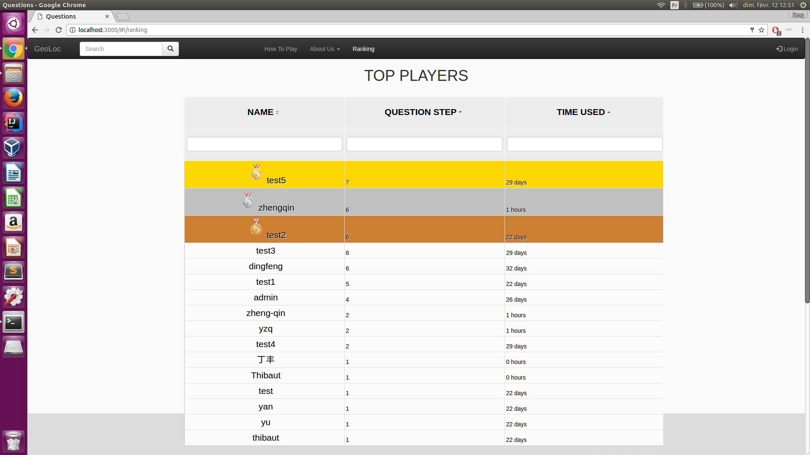
### Admin Mode
#### Add a Question
As an admin, you could also add new questions to extend your game.
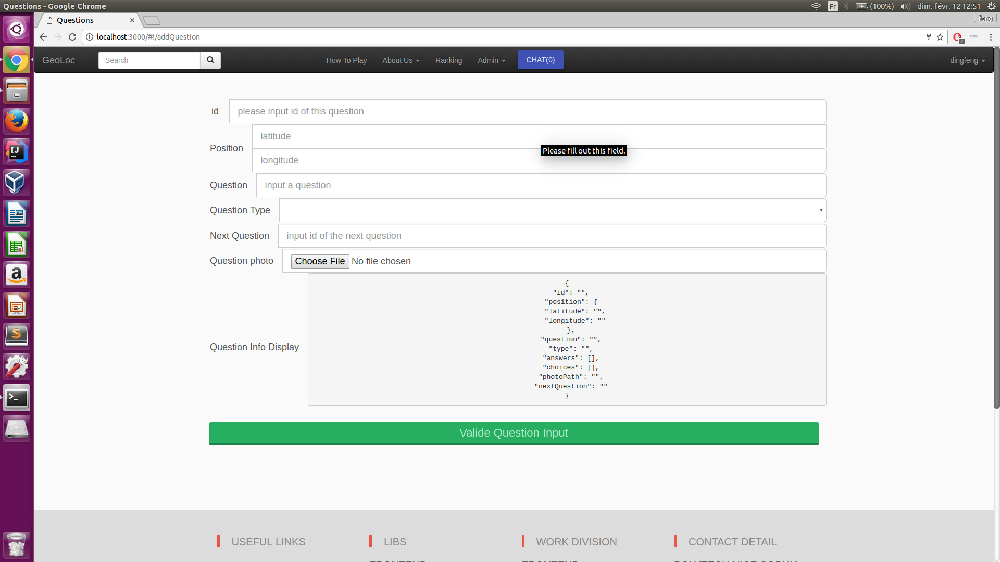
#### Question Management
You could also modify or delete the questions exist.
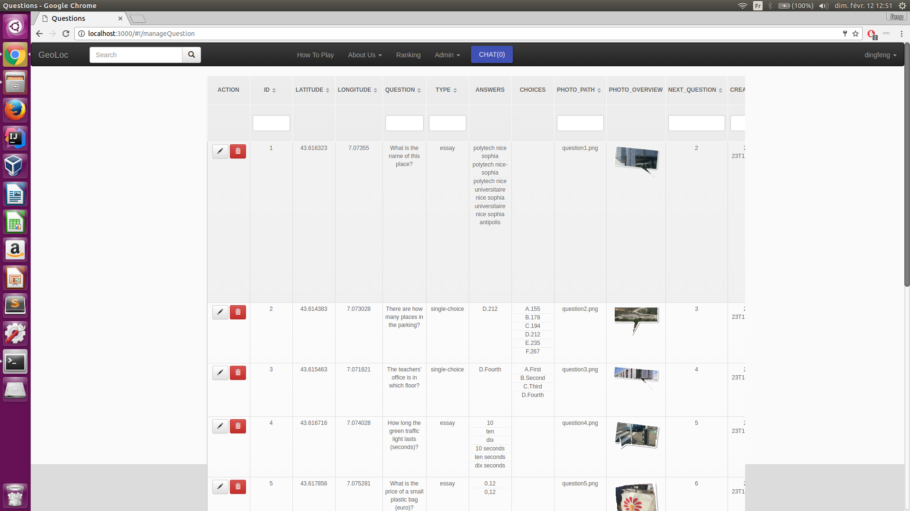
### Question Overview
In this page you could use all the questions added from a google map.
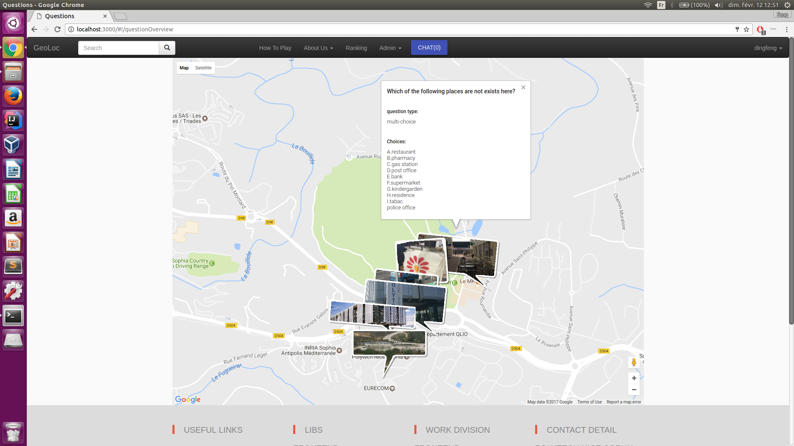
### User Management
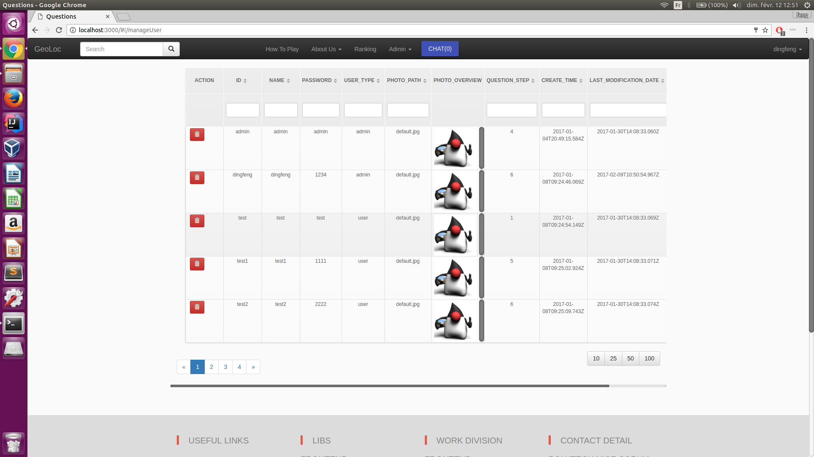
### Chat
You could also chat with the palyers who are now answering the same question.
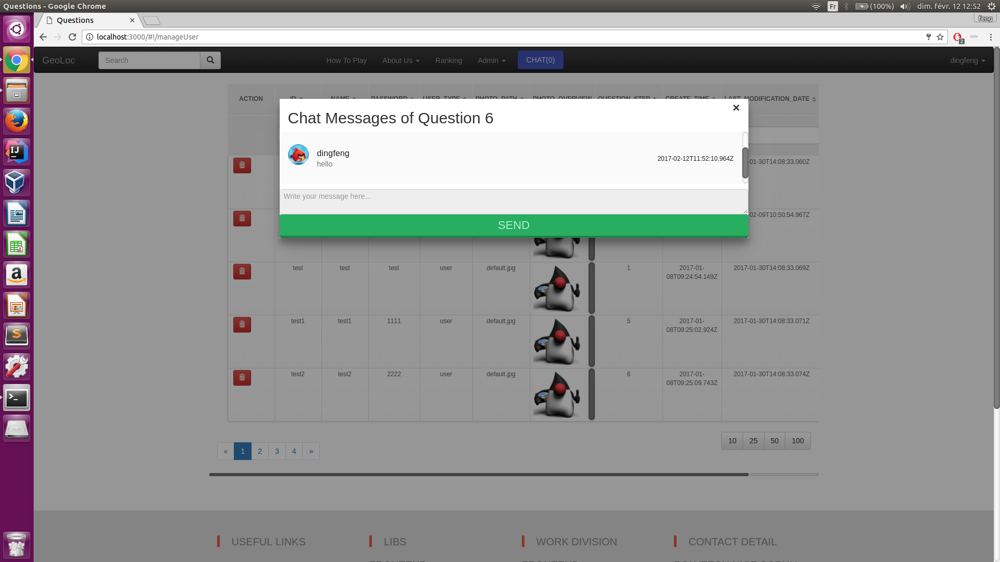
### Player Mode
#### Question Location
This page show you the position of your current question and also the questions that you passed.
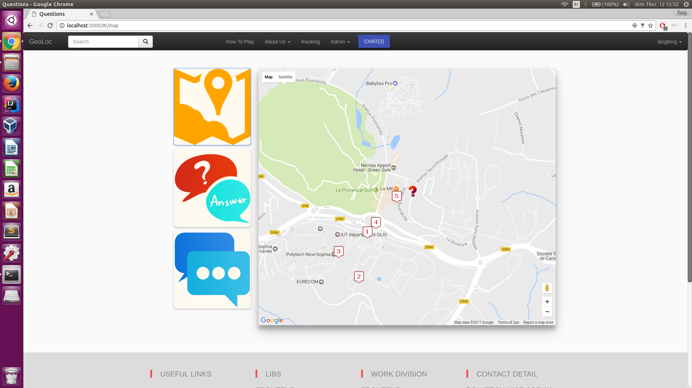
#### Question & Answer
If you find the place, you could answer the question at this page. You just have 5 chance to answer a choice question. If you use up your chance, you need to wait util you obtain new chance. (60 minute + 1 chance, 5 chance max)
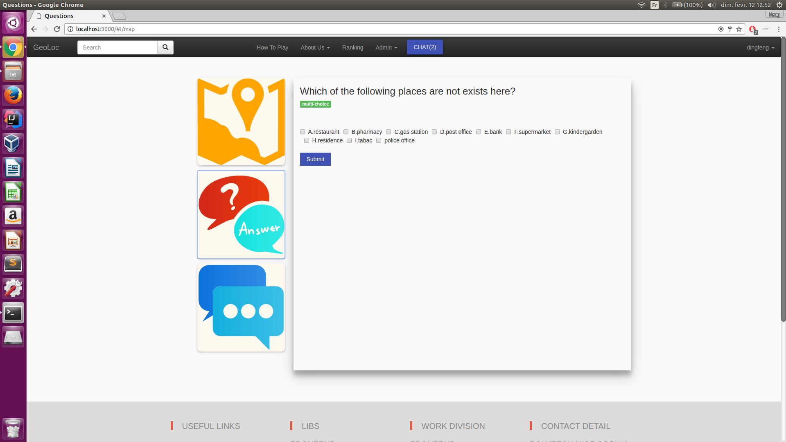
#### Question Blog
You could also leave your comment here, also with your pictures. Or send your love to other comment.
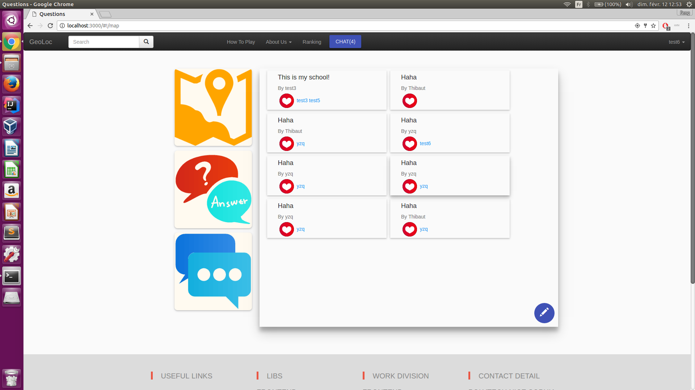
#### Question Navigation
If you have difficult to find the location of a question, you could click on the question mark to start a navigation.
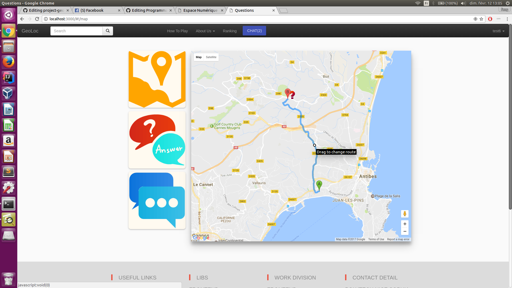

## Links
[MongoDB offical website][1]
[MongoDB installation][2]
[ECMAScript][6]
[NodeJs offical website][7]
[Bower installation][8]

[1]: https://www.mongodb.com/
[2]: https://docs.mongodb.com/manual/installation/
[3]: https://docs.mongodb.com/manual/administration/install-on-linux/
[4]: https://docs.mongodb.com/manual/tutorial/install-mongodb-on-os-x/
[5]: https://docs.mongodb.com/manual/tutorial/install-mongodb-on-windows/
[6]: http://es6-features.org/
[7]: https://nodejs.org/en/
[8]: https://bower.io/
[9]: http://localhost:3000
[10]: http://localhost:27017
[11]: https://www.youtube.com/watch?v=YAV987vaAEE
